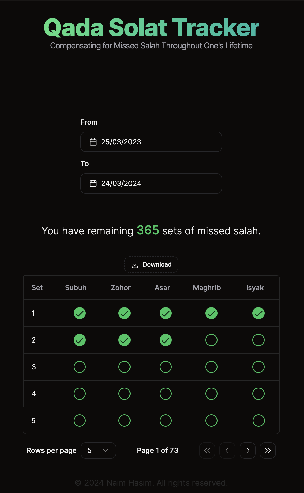
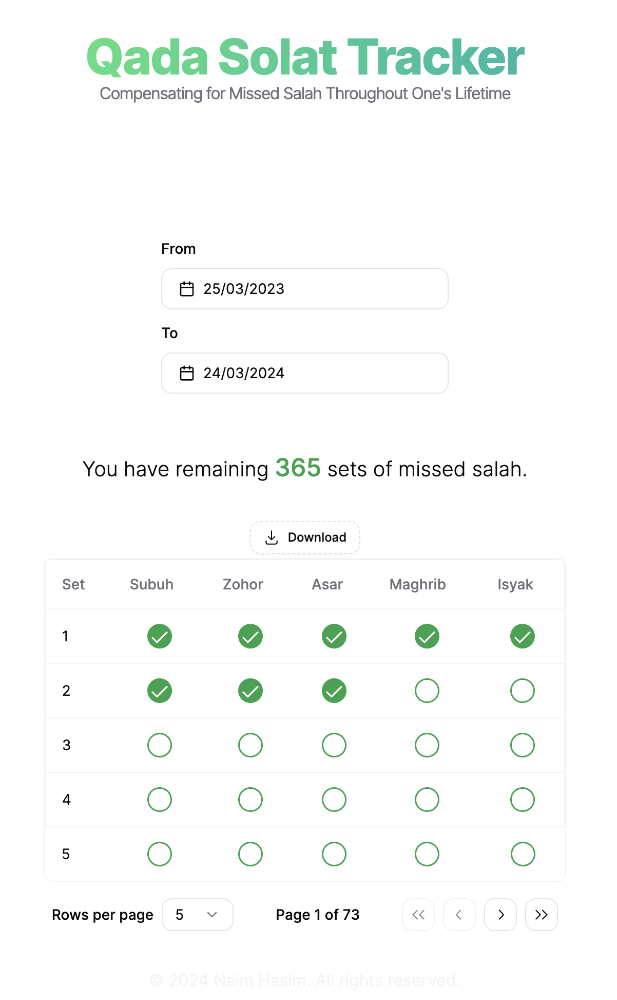

## <div style="margin-left: auto; margin-right: auto; display:block; weight: 100%;">[Qadasolat](https://qadasolat.vercel.app)</div>
  - A tool to help Muslims keep track of missed prayers (qada solat) and facilitate the process of making up for them.
  - The project aims to assist users in managing their prayers effectively by providing a solution to organize and fulfill missed prayers.
<br>
<hr>
<br>

<div style="display:flex; justify-content: center; gap: 2.5rem">
  
  
</div>


  
## Features
  - Track missed prayers (qada solat).
  - Assist in making up for missed prayers.
  - User-friendly interface for easy navigation.
  - Export prayer progress in PDF format.

## Upcoming Features
  - Save qada progress and access it from anywhere

### Getting Started

  ### Installation
  1. Clone the repository ``` git clone git@github.com:naimhasim/qadasolat.git```
  2. Install necessary dependencies ```npm install```
  3. Run the development server ```npm run dev``` to start using the application.

### Contribution
- Contributions and feedback are welcome. Feel free to contribute by forking the repository and creating pull requests.

### Contact
- For inquiries or feedback, reach out to me on [GitHub](github.com/naimhasim).
